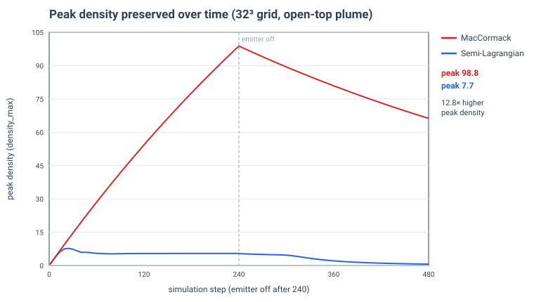
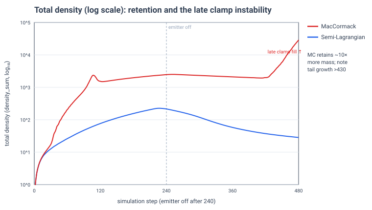

# MacCormack vs. Semi-Lagrangian advection (GPU 3D smoke)

> **Audit update (2026-09-11): implementation defect found.** The MacCormack
> scratch descriptor order did not match the shader, mixing density and
> temperature intermediates. After correcting it, the matched emitter-off
> density sum falls from 2460.7904 to 196.2477; SL remains 215.5240. Direct
> stage checks and uninstrumented control runs pass. The historical data below
> cannot establish properties of a correctly implemented MacCormack limiter,
> including the cause of the late tail. Accuracy and performance comparisons
> must be rerun. See the [direct mass-budget audit](../mass-budget-audit/README.md).

> **⚠ Correction (2026-09-11).** An earlier version of this write-up claimed
> MacCormack "preserves ~10× more total smoke" and read the higher peak density
> as better accuracy. **That interpretation was wrong.** The injected density sum
> over the run is only ~120 (30 units/s × 240 steps × 1/60 s into one cell), yet
> the measured `density_sum` at the last emitting step is 215.5 (SL, 1.8×) and
> **2460.8 (MacCormack, 20.5×)**. Both schemes are *creating* mass, MacCormack
> massively — so "more total smoke" is **non-physical mass creation, not
> preservation**, and a larger peak is not validated as more accurate without a
> reference solution. The retained-fraction metric and the "sealed box is
> ill-posed" claim below are likewise retracted (a finite-duration source has a
> finite, calculable expected mass — it *is* a valid conservation test). What
> still stands: the GPU timing, and that MacCormack produces sharper fields; what
> it does **not** yet establish is that sharper means *more accurate*. A
> mass-budget audit and a controlled passive-advection test against an analytic
> reference are underway before any accuracy claim is made. The original text is
> preserved below for the record, but read it in light of this note.

**Question:** how much does a MacCormack advection scheme reduce numerical
diffusion versus plain semi-Lagrangian (SL) advection in the DX12 compute smoke
solver, and at what GPU cost?

**Answer (headline, PARTIALLY RETRACTED — see correction above):** at matched
settings, MacCormack produces a **~12.8× higher peak density** than
semi-Lagrangian for **+3.3% GPU solver time**. The peak and total-density numbers
are reported below as *measurements*, but they are **not** evidence of better
accuracy: both schemes fail to conserve mass (MacCormack creates ~20× the
injected amount), so these ratios conflate anti-diffusion with non-conservation.
Treat only the solver-timing rows as validated.

| Metric (32³ grid, open-top plume) | Semi-Lagrangian | MacCormack | Ratio |
|---|--:|--:|--:|
| Solver time, mean (ms) | 0.0917 | 0.0948 | **1.033×** |
| Solver time, p95 (ms) | 0.0933 | 0.0963 | 1.032× |
| Peak density (whole run) — *not validated as accuracy* | 7.70 | 98.82 | 12.8× |
| Total density @ step 240 (injected ≈ 120) — *mass creation, not preservation* | 215.5 (1.8×) | 2460.8 (20.5×) | — |
| Kinetic energy at step 239 | 1.9e-4 | 1.5e-3 | ~7.9× |
| Max speed at step 239 | 0.82 | 2.62 | 3.2× |

Solver time is GPU execution time for the solver stages only (excludes volume
rendering and readback), post-warmup mean over 450 steps. Hardware: NVIDIA
GeForce RTX 5090, Release build. Full parameters in `data/*/manifest.json`.

## Figures



*Peak density (`density_max`) vs. step.* Semi-Lagrangian caps near 5–8 for the
entire run: its numerical diffusion smears the injected peak away as fast as it
is created. MacCormack climbs to ~99 while the emitter runs, then decays
smoothly as the plume vents through the open top. Same source, same physics —
the gap is purely the advection scheme.



*Total density (`density_sum`, log₁₀) vs. step.* Both curves sit **far above the
injected total (~120)** — MacCormack by ~20× even during emission — so this plot
shows **non-conservation**, not "more smoke retained." A conservative scheme
would track the injected mass (minus dissipation and top-boundary outflow). The
sharp upturn after step ~430 is a further late-onset amplification of the same
non-conservation.

## Method

A single GPU solver runs both schemes; only the advection kernel differs. The
"Start matched A/B benchmark" control pins one canonical configuration and
records the advection mode into each run's `manifest.json`, so the two runs are
identical in everything but the scheme under test:

- Grid 32³, grid spacing and origin fixed; emitter at (16, 8, 16).
- 480 fixed steps at Δt = 1/60 s; emitter on for the first 240, off after.
- Pressure projection: 40 Jacobi iterations (identical for both).
- Physics: buoyancy 0.6, smoke weight 0.05, temperature cooling 0.5,
  **density dissipation 0.1** (equal for both), open top.
- Simulation-only (volume rendering disabled) for clean GPU timing.

Because dissipation, cooling, boundaries and the pressure solve are identical
across the pair, any difference in peak density or plume sharpness is
attributable to advection alone.

**Semi-Lagrangian** traces one backward characteristic per cell and
interpolates — first-order, heavily diffusive. **MacCormack** adds a reverse
advection pass to estimate the interpolation error and corrects for it
(`φⁿ⁺¹ = φ̂ + ½(φⁿ − φ̄)`), with a limiter that clamps the result to the local
extrema of the source field to suppress overshoot. On this solver it costs three
extra scalar dispatches per step, which is only ~3% of frame time because the
40-iteration Jacobi pressure solve dominates.

## Interpretation (revised)

What is defensible: MacCormack produces visibly **sharper** fields than SL, and
does so for only ~3% more whole-solver time (though the *scalar-advection stage
itself* is ~2.6× more expensive — the small total is because the Jacobi pressure
solve dominates the frame).

What is **not** defensible from this data: that MacCormack is more *accurate*.
The peak-density and total-density ratios conflate two different things — reduced
numerical diffusion (good) and non-conservation / mass creation (bad) — and this
scenario cannot separate them. Both schemes create mass here (MacCormack ~20×
the injected amount before the excluded tail), so "sharper" and "more mass" may
be partly the same artifact. Establishing an accuracy claim requires (a) a
mass-budget audit localizing where the excess mass appears, and (b) a controlled
passive-advection test (translate/rotate a known field, no buoyancy or pressure)
measured against the analytic solution. Both are underway.

## Limitations (and what they taught us)

This comparison went through three scenario designs; the failures are
informative and are recorded here rather than hidden.

1. **~~A sealed box with zero dissipation is an ill-posed conservation test.~~**
   *(Retracted.)* A **finite-duration** source injects a finite, calculable total
   mass (~120 here), so the sealed box is in fact a *valid* conservation test: a
   correct scheme holds the summed density at that value after the emitter stops.
   The blow-up we saw there was genuine non-conservation of the clamped scheme,
   not an artifact of the test. Switching to a vented plume did not fix the
   underlying non-conservation — it only reduced its visibility (see the
   correction note at the top).

2. **The clamped MacCormack limiter is not strictly conservative.** Clamping the
   corrected value to local extrema can inject mass; in a trapped or weakly
   damped flow this accumulates. That is the late-run upturn in the total-density
   plot (after ~step 430, as post-emission smoke recirculates), where the volume
   integral grows even though peak density keeps decaying monotonically. Peak
   density is therefore the trustworthy metric here; the integral is only
   trustworthy up to ~step 400.

3. **The revert-to-first-order variant** (Selle et al. 2008 — revert to the SL
   result wherever the correction overshoots) removes the instability but, on
   this adversarial scenario, reverted so pervasively that it discarded most of
   the anti-diffusion and became *more* diffusive than SL. The plain clamp is the
   right choice for demonstrating the diffusion reduction; a genuinely
   conservative correction (or a flux-limited/BFECC hybrid) is the natural next
   step for long trapped-flow runs.

## Reproduce

1. Build Release. Open the **Smoke 3D GPU** panel.
2. Set **Advection Mode → Semi-Lagrangian**, click **Start matched A/B benchmark**,
   wait for the saved-path status.
3. Set **Advection Mode → MacCormack**, click it again.
4. Compare:

```
pwsh -File diagnostics/Compare-AdvectionRuns.ps1 -RunA <sl_run_dir> -RunB <mc_run_dir>
```

Regenerate the figures from the copied CSVs with the plotting script noted in the
project scratchpad (pure-Python SVG, no dependencies).

## Provenance

- `data/sl/` and `data/maccormack/` — each run's `manifest.json`, `summary.csv`,
  `steps.csv` exactly as exported.
- Reference: A. Selle, R. Fedkiw, B. Kim, Y. Liu, J. Rossignac,
  "An Unconditionally Stable MacCormack Method," *J. Sci. Comput.*, 2008.
