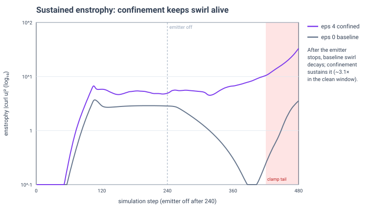
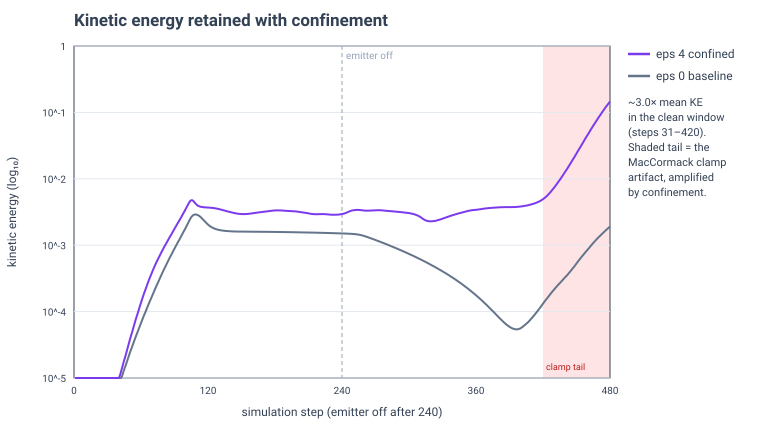

# Vorticity confinement (GPU 3D smoke)

> **Audit update (2026-09-11): these runs used an affected MacCormack path.**
> The [direct mass-budget audit](../mass-budget-audit/README.md) found and fixed
> scratch descriptor ordering that mixed density and temperature intermediates.
> The measurements below describe that historical implementation. The claimed
> quality/cost tradeoff and the explanation of the late tail need new matched
> runs on the corrected solver; the existing ratios are not validated evidence
> for a correctly implemented MacCormack-plus-confinement method.

**Question:** does a Fedkiw-style vorticity-confinement force measurably restore
the small-scale rotational motion that projection and advection damp out, and at
what GPU cost?

**Answer (headline):** yes. At matched settings, confinement strength ε ≈ 4
**sustains ~3.1× the enstrophy and ~3.0× the kinetic energy** of the ε = 0
baseline through the clean part of the run, for **+5.6% GPU solver time**. The
effect is clearest *after the emitter shuts off*: the baseline plume's swirl
decays away, while the confined plume keeps rotating.

| Metric (32³ grid, open-top plume, MacCormack advection) | ε = 0 | ε ≈ 4 | Ratio |
|---|--:|--:|--:|
| Solver time, mean (ms) | 0.0949 | 0.1002 | **1.056×** |
| **Mean enstrophy** (steps 31–420) | **1.64** | **5.04** | **3.1×** |
| **Mean kinetic energy** (steps 31–420) | 9.4e-4 | 2.8e-3 | **3.0×** |
| Peak vorticity (whole run) | 38.8 | 48.5 | 1.25× |

Enstrophy is the integral of \|∇×u\|² over fluid cells — the small-scale
rotational energy confinement is designed to sustain. Means are over the clean
window (steps 31–420); see *Limitations* for why the last ~60 steps are excluded.
Hardware: NVIDIA GeForce RTX 5090, Release build. Exact ε = 4.017 (ImGui float
slider). Full parameters in `data/*/manifest.json`.

## Figures



*Enstrophy (log scale) vs. step.* Both curves rise together while the emitter
runs. The divergence appears after **emitter-off (step 240)**: the baseline
(grey) decays by more than a decade as rotation dissipates, while the confined
run (purple) holds its enstrophy roughly flat — the technique keeping swirl alive
that would otherwise be lost. The shaded region (steps 420–480) is a numerical
artifact discussed below, excluded from the reported means.



*Kinetic energy (log scale) vs. step.* The same picture in the velocity field:
confinement retains roughly 3× the flow energy through the decay phase.

## Method

A single GPU solver; the confinement force is toggled by a strength ε, so ε = 0
runs the untouched baseline and ε > 0 adds the force. The matched A/B benchmark
pins one canonical configuration and records ε into each `manifest.json`, so the
two runs are identical except for confinement:

- Grid 32³; 480 fixed steps at Δt = 1/60 s; emitter on for the first 240.
- MacCormack advection, 40 Jacobi pressure iterations, open top.
- Physics: buoyancy 0.6, smoke weight 0.05, cooling 0.5, density dissipation 0.1
  — identical across the pair.
- Simulation-only (volume rendering disabled) for clean GPU timing.

**The force** (Fedkiw et al. 2001) is applied to velocity *before* projection, in
two compute passes: pass 1 computes cell-centred vorticity ω = ∇×u; pass 2 forms
`N = ∇|ω| / |∇|ω||` and adds `ε · h · (N × ω)` back to the MAC faces. It costs
~5.6% of solver time — the two passes are cheap next to the 40-iteration Jacobi
solve, and confinement is disabled entirely at ε = 0.

**Measurement.** A dedicated `ReduceEnstrophyCS` pass recomputes vorticity from
the *final projected* velocity each step and sums \|ω\|², so enstrophy is
recorded for both ε = 0 and ε > 0 regardless of whether the force ran. It
executes after the step-timing window, so it does not inflate solver timings.

## Interpretation

Vorticity confinement targets exactly the failure mode of a stable-fluids solver:
the pressure projection and the advection interpolation bleed away small-scale
rotation, so plumes go smooth and lifeless. The enstrophy plot isolates that
effect. During emission both runs are driven hard and look similar, but once the
source stops, the baseline's rotation dissipates within ~120 steps while the
confined run sustains it — visible as persistent curl and detail in the plume
rather than a diffuse column. A ~3× sustained-enstrophy gain for ~5% solver time
is an excellent trade, and it stacks with the MacCormack advection result:
MacCormack keeps the density sharp, confinement keeps the motion curling.

ε = 4.017 was tuned by eye for visible swirl without high-frequency noise;
larger ε adds detail but eventually fights the projection and injects grid-scale
artifacts.

## Limitations

- **Late-run tail (steps > 420).** Both runs show enstrophy and kinetic energy
  turning sharply upward in the final ~60 steps. This is the same non-conservative
  MacCormack clamp behaviour documented in the advection experiment
  (`../advection-maccormack-vs-sl/`): post-emission recirculating smoke slowly
  amplifies under the limiter. Confinement **injects energy, so it amplifies that
  tail further** (ε = 4 enstrophy runs to ~33 by step 480 vs the baseline's ~3.5).
  The reported means exclude this window; treat any metric past ~step 420 as
  contaminated. A conservative advection correction would remove it and let the
  comparison run indefinitely.
- **Confinement is not energy-conserving by construction** — it is a modelling
  force that adds rotational energy, so "more enstrophy" is the intended effect,
  not a free lunch. The right way to read the result is *sustained detail per
  millisecond*, which is what the clean-window ratios report.
- Vorticity here is cell-centred central differences on a MAC grid — adequate for
  confinement, but a proper edge-based curl would be more accurate near the
  obstacle and walls.

## Reproduce

1. Build Release. Open the **Smoke 3D GPU** panel; tune **Vorticity Epsilon** live
   to taste.
2. Set **Vorticity Epsilon = 0**, click **Start matched A/B benchmark**, wait for
   the saved path.
3. Set **Vorticity Epsilon = <tuned>**, click again.
4. Compare (hold advection mode fixed across the pair):

```
pwsh -File diagnostics/Compare-VorticityRuns.ps1 -BaselineRun <eps0_dir> -ConfinedRun <epsN_dir>
```

## Provenance

- `data/baseline_eps0/` and `data/confined_eps4/` — each run's `manifest.json`,
  `summary.csv`, `steps.csv` as exported (now including `enstrophy` and
  `max_vorticity` columns).
- Reference: R. Fedkiw, J. Stam, H. W. Jensen, "Visual Simulation of Smoke,"
  SIGGRAPH 2001 (vorticity confinement, §5).
